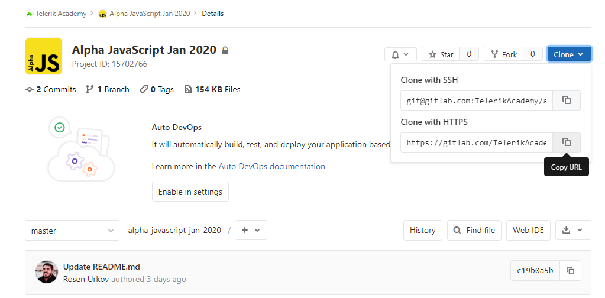
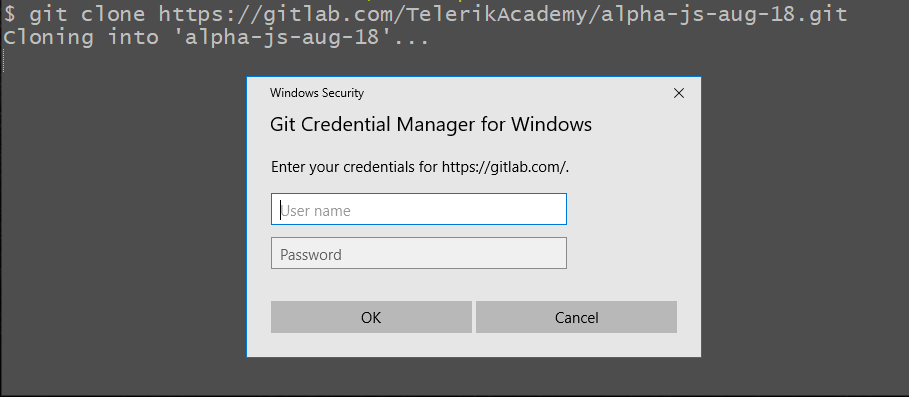
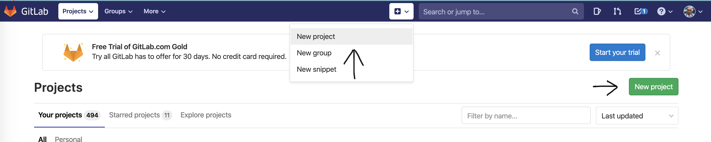
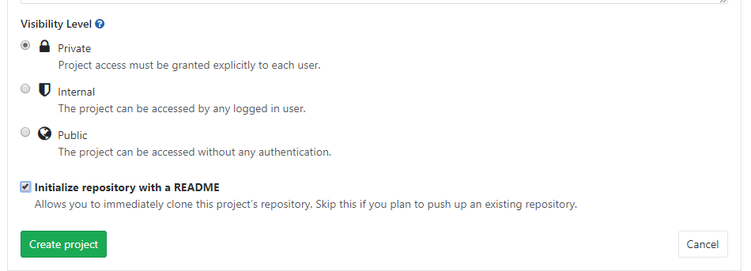
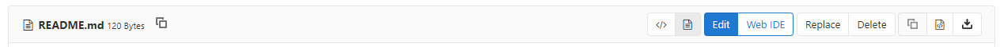

# Git - Tasks

### 1. Create an account in [https://gitlab.com](https://gitlab.com)

   - If you already have one it is okay to use it.
   

### 2. Clone the Alpha repository

   - Open [https://gitlab.com/TelerikAcademy/alpha-24-js](https://gitlab.com/TelerikAcademy/alpha-24-js)

     

   - Copy the **HTTPS url**
   - Open a folder where you will store your repositories
   - Right click and use **Git Bash Here** option
   - Execute the following command (it will clone the repository to your computer)

     ```bash
     git clone https://gitlab.com/TelerikAcademy/alpha-24-js
     ```

   - Windows: It will prompt you for credentials from gitlab.com (it is a one time only)

     

      - If you misspell your credentials you need to go to *Control Panel -> User Accounts -> Credential Manager.* Click on **Windows Credentials**. Down in the **Generic Credentials** window click on *git -> edit* - now eneter the correct credentials.

### 3. Practice
1. Create a new repository

   

   - Name it A24-{Your-Name}, for example A24-Nadya-Atanasova
   - It is **mandatory** to be private
   - You are **not allowed** to commit any of the exam tasks there

     

1. Make local changes

   - Now clone your newly created repository like the one which we showed earlier
   - Make a change to the README.md file
     - Open the folder and right click and use **Git Bash Here** option again
       - Type **git status** - this will show you all the files that have been changed/modified/deleted
     - Or use any GUI (Graphical User Interface) such as, VSCode, Git Kraken, Source Tree, etc.
   - Now you have to sync your local changes with gitlab.com.
   - How you can do that?

1. Make changes in gitlab (it is like someone pushed new changes there)

   - Open [https://gitlab.com](https://gitlab.com)
   - Navigate to your repository
   - Open the README.md file
   - Now with the **Edit** button you can make changes

     

   - Now you have to sync the changes to your local repository. How you can do that?

1. Add your work so far

   - Go to your projects
   - Copy them in cloned repo. Use some nice organization, for example JS Core / Functions / Tasks
   - Commit newly added files
   - Update the remote 

**HINTS**

Use any GUI by your choice - **preferably VSCode** or you could use the commands below and figure out how to use them

```bash
git pull
git add .
git push
git commit -m "Some message"
```
